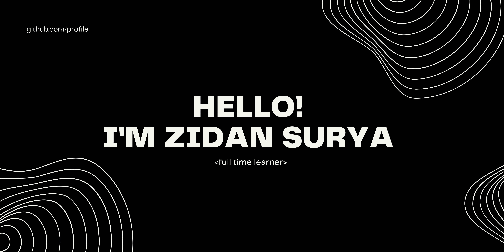

## Glad to see you here! 
I'm Zidan Surya, an undergraduate eletrical eng. student from Faculty of Electrical Engineering, Telkom University and have a special interest in artificial intelligence and machine learning, especially how to integrate machine learning with the industry area and using it within the business scope. I am a responsible person and have a high willingness to learn a new thing.

<a href="https://www.linkedin.com/in/zidansurya/" title="linkedin">
  <width="100px" height="40px" src="https://github.com/get-icon/geticon/raw/master/icons/linkedin.svg" alt="Linkedin" ></a>
  

